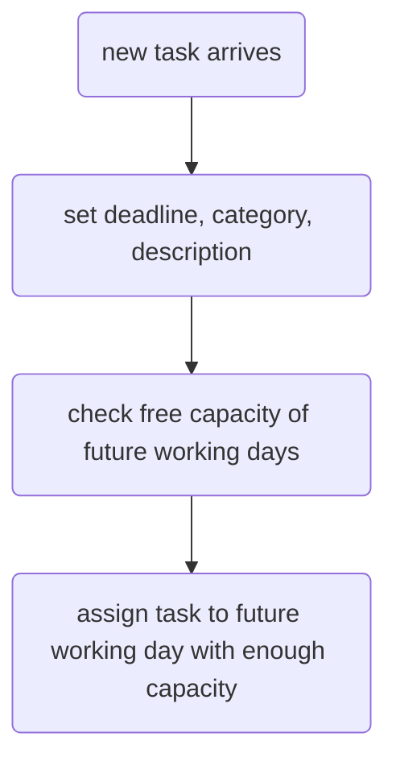
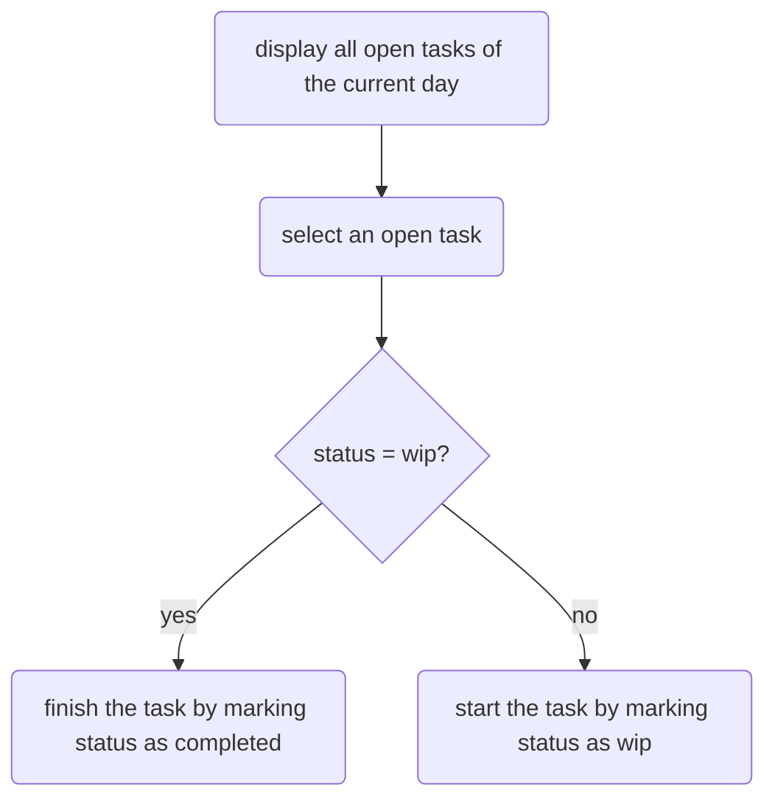
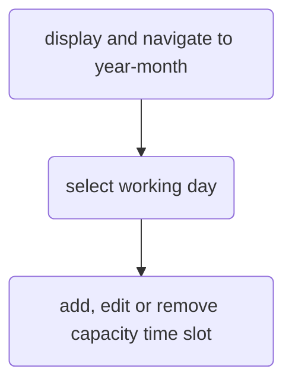

# Glowing Spoon Productivity

This is a productivity manager to arrange incoming tasks to available time slots on future working days.

## Workflows

There are three main workflows for productivity management.
-   assign a new incoming task to a future working day
-   start and complete an open task on the current working day
-   assign working capacity to future working days

### Assign a new task

### Manage an open task

### Manage working capacity

## Features
-   assign an incoming task to an available time slot on a specific day
-   show all tasks for a specific day for user and free capacity on this day
-   show all available capacity time slots for a day and a week for user
-   mark a task as complete
-   mark a task as wip
-   CRUD for task
-   CRUD for capacity time slot
-   login and registration with email only
-   lins between tasks and capacity for smooth navigation

## Future Features
-   receive an email to create a new task
-   send an email every morning with the assigned tasks of the current day
-   receive a calendar invitation to create a new capacity time slot
-   split or merge tasks
-   detect conflicts between capacity time slots (overlap)
-   show task whih are overdue and re-assign them to a new time slot
-   email confirmation on registration
